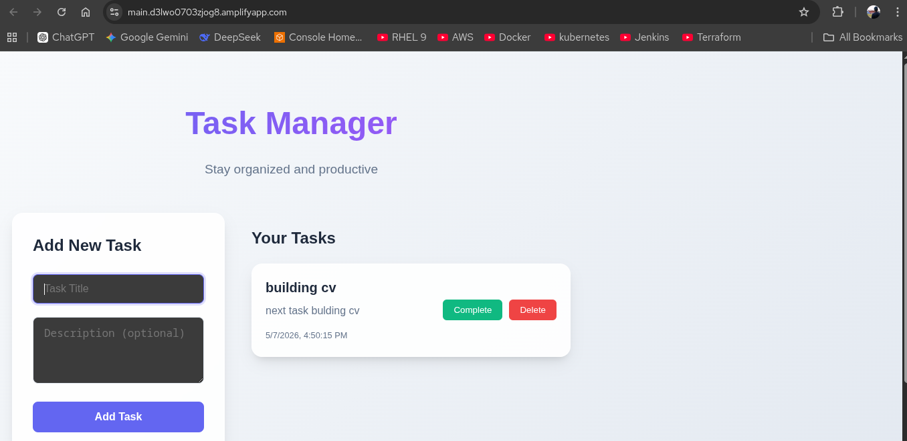
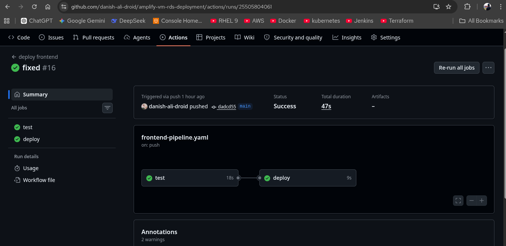
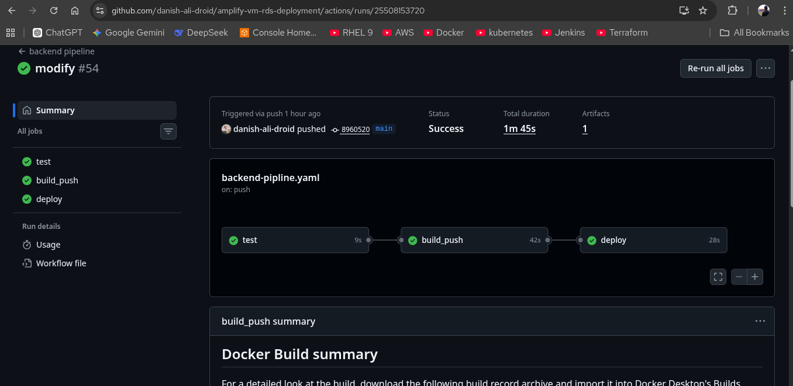
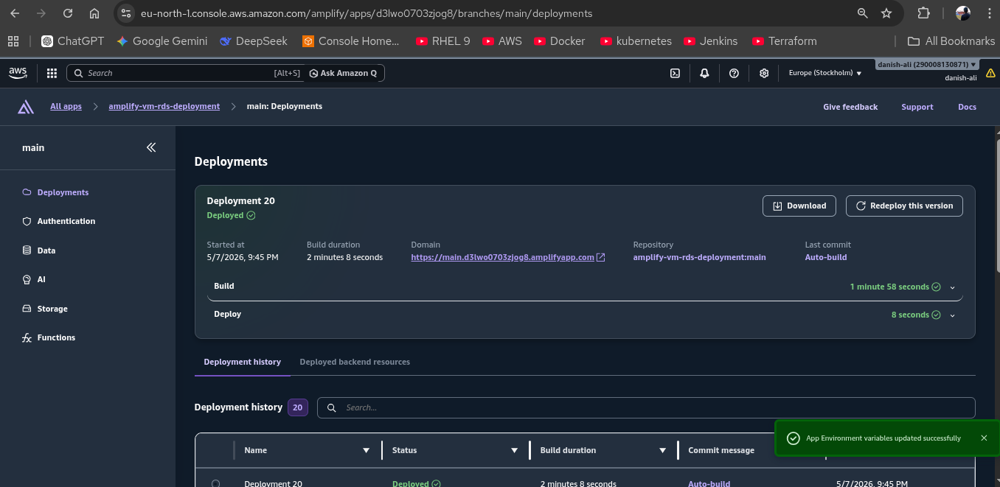
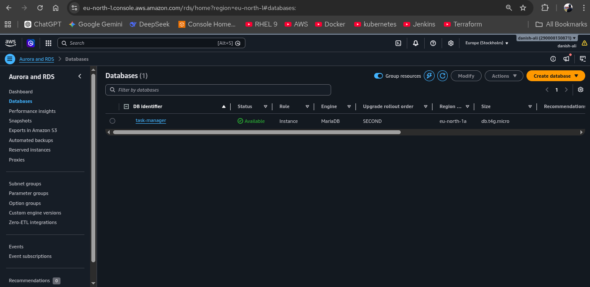

# Three-Tier Application Deployment Architecture


## Frontend on AWS Amplify + Backend on Docker + Database on AWS RDS + Cloudflare Tunnel

---

## What This Project Is

This is a real-world solution for deploying a modern web application across multiple cloud and on-premise services. The frontend is a responsive React application hosted on AWS Amplify, the backend runs as a PHP application inside Docker containers on your local virtual machine, and the database is a MariaDB instance managed by AWS RDS. The innovative part is how these three layers communicate securely using Cloudflare Tunnel to bridge the gap between HTTPS (Amplify) and HTTP (local backend).

---

<div align="center">
  
  <p><em>Your React application dashboard interface - the user-facing layer of the system</em></p>
</div>

## Understanding the Frontend Layer

The frontend is built with React, a modern JavaScript framework that creates an interactive, responsive user interface. It's deployed on AWS Amplify, which provides automatic HTTPS encryption for all communication. When users visit your application, they're accessing it through a secure connection, and Amplify handles all the infrastructure complexity behind the scenes. The application communicates with the backend to fetch data, send updates, and manage business logic.

---

<div align="center">
  
  <p><em>The continuous integration pipeline for frontend deployment</em></p>
</div>

## Frontend Deployment Pipeline

Every time you push code to the main branch, an automated pipeline kicks in. First, the system installs all necessary Node.js dependencies and runs tests to ensure the code quality. Then it builds the React application into optimized static files. Finally, AWS Amplify takes these files and deploys them to a global content delivery network, making your application fast for users worldwide. This entire process happens automatically without manual intervention.

---

<div align="center">
  
  <p><em>The continuous integration pipeline for backend deployment</em></p>
</div>

## Backend Deployment Pipeline

The backend follows a similar automated approach. When changes are pushed, the system sets up a PHP 8.2 environment and runs unit tests using PHPUnit. Once tests pass, Docker builds a container image that packages your PHP application with all dependencies. This image is pushed to Docker Hub, your container registry. Finally, your local VM automatically pulls and runs this new image, replacing the old version seamlessly. This ensures your backend is always running the latest tested code.

---

<div align="center">
  
  <p><em>AWS Amplify hosting and deployment management</em></p>
</div>

## Why AWS Amplify for Frontend Hosting

AWS Amplify is specifically designed for modern web applications. It automatically handles HTTPS certificates, manages deployments, and scales infrastructure based on traffic. It integrates directly with GitHub, so every push automatically triggers a build and deployment. The service includes environment variables management, monitoring, and rollback capabilities. For developers, it removes the complexity of managing servers and infrastructure, letting you focus on building features.

---

<div align="center">
  
  <p><em>AWS RDS MariaDB instance configuration</em></p>
</div>

## The Database Layer with AWS RDS

MariaDB is a robust, open-source relational database that powers your application data. By hosting it on AWS RDS (Relational Database Service), you get automated backups, security patches, and the ability to scale storage without downtime. RDS handles database maintenance in the background, so you don't need to manage database servers yourself. Your local backend container connects to this database to store and retrieve all application data like tasks, users, and configurations.


---

## The Key Challenge: HTTPS Meets HTTP

Here's the problem that makes this architecture interesting: AWS Amplify serves your frontend over HTTPS (secure), but your local PHP backend runs over HTTP (not encrypted). Modern browsers have a security policy that prevents HTTPS pages from making requests to HTTP endpoints. This causes a "Mixed Content Error" that blocks communication between your frontend and backend.

The traditional solutions are expensive or complicated:
- Getting a real SSL certificate for your home IP
- Exposing your local network to the internet
- Moving the backend to the cloud (defeating the purpose of local development)

---

## The Solution: Cloudflare Tunnel

Cloudflare Tunnel solves this elegantly. It creates a secure encrypted connection from your local VM to Cloudflare's global network. Your frontend doesn't know it's talking to a local machine—it sees a standard HTTPS URL on Cloudflare's domain. The tunnel then bridges this secure connection down to your local HTTP backend. This means:

- Your frontend gets a proper HTTPS endpoint (no Mixed Content Error)
- Your backend stays on your local network (completely private)
- You don't need to open any ports or buy any certificates
- The tunnel is encrypted end-to-end
- Everything is free (Cloudflare offers free tunnels)

---

## How Everything Flows Together

When a user interacts with your React application, here's what happens:

1. The user's browser requests data from the frontend React app
2. React makes an API call to your Cloudflare tunnel URL (HTTPS)
3. Cloudflare receives the request securely and forwards it to your local VM
4. Your PHP backend receives the request over HTTP and processes it
5. The backend queries the AWS RDS database for information
6. MariaDB returns the data
7. PHP formats the response and sends it back through the tunnel
8. Cloudflare securely delivers it to the user's browser
9. React updates the interface with the fresh data

This entire flow is automated and happens in milliseconds, creating a seamless user experience.

---

## Project Structure and Organization

The project is organized into clear, logical sections that handle different aspects of the application:

```
amplify-vm-rds-deployment/
├── frontend/                    # React Application (AWS Amplify)
│   ├── src/
│   │   ├── components/         # Reusable React components
│   │   ├── App.jsx            # Main application wrapper
│   │   └── index.jsx          # Entry point
│   ├── package.json           # Node.js dependencies
│   └── Dockerfile             # Container configuration for frontend
│
├── backend/                     # PHP Application (Docker on VM)
│   ├── api/
│   │   ├── tasks.php          # API endpoints for operations
│   │   └── config/db.php      # Database connection settings
│   ├── tests/                 # Unit tests for backend
│   ├── Dockerfile             # Container configuration for backend
│   └── composer.json          # PHP dependencies
│
├── database/                    # Database Layer (AWS RDS)
│   └── schema.sql             # Database structure and tables
│
└── .github/workflows/          # Continuous Integration
    ├── frontend-pipeline.yaml  # Automated frontend deployment
    └── backend-pipline.yaml    # Automated backend deployment
```

---

## Technology Stack Overview

**Frontend Technologies**
- React for building the user interface
- Axios for making HTTP requests to the backend
- CSS for styling the application
- AWS Amplify for hosting and auto-deployment

**Backend Technologies**
- PHP as the server-side language
- Apache web server inside Docker
- PDO for secure database connections
- PHPUnit for automated testing

**Database Technologies**
- MariaDB for data storage
- AWS RDS for managed database service

**Networking & Security**
- Cloudflare Tunnel for secure HTTP-to-HTTPS bridging
- Docker for containerization and environment consistency

---

## Environment Configuration

Your application needs specific configuration to work:

- Frontend needs to know where the backend API is located
- Backend needs database credentials to connect to RDS
- Each service runs in its own isolated environment

These settings are managed through environment variables that never get committed to Git, keeping sensitive information secure. Configuration is environment-specific, meaning your development setup differs from your production setup, but the code remains the same.

---

## Continuous Integration and Automated Deployment

Both frontend and backend use GitHub Actions for automation:

**Frontend Workflow**: When code changes are pushed, the system automatically installs dependencies, runs tests, builds the optimized React application, and deploys it to AWS Amplify. This ensures every deployment is tested and consistent.

**Backend Workflow**: Changes trigger installation of PHP dependencies, execution of unit tests, building of a Docker container, pushing to the registry, and redeployment on your local VM. The old version is automatically replaced with the new one.

This automation ensures every deployment is tested, consistent, and reliable without requiring manual steps.

---

## Security Practices

This architecture implements several security measures:

- Sensitive data (passwords, API keys) never appears in code or Git history
- HTTPS encryption protects all frontend communication
- The Cloudflare Tunnel adds an additional security layer
- Database access is restricted to your local network
- Container images are version-controlled and scanned
- All credentials are managed through secure environment variables
- Database connections use PDO with prepared statements to prevent SQL injection

---
